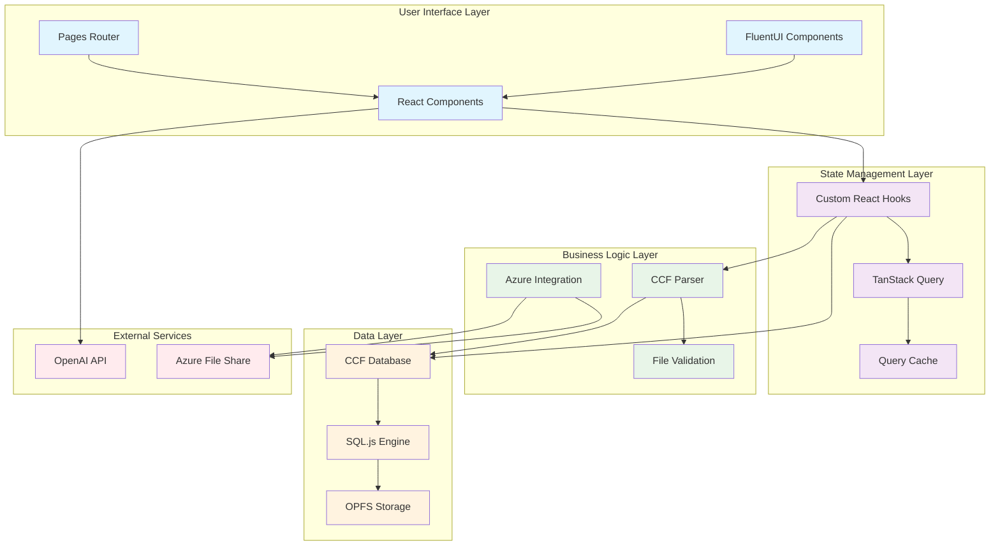

# CCF Ledger Explorer Architecture Overview

## System Architecture

CCF Ledger Explorer is a modern, client-side React application built with TypeScript that enables users to parse, store, and analyze CCF (Confidential Consortium Framework) ledger data entirely within their browser. The application follows a layered architecture pattern with clear separation of concerns.

## High-Level Architecture Diagram



## Core Components

### 1. User Interface Layer

#### React Components (`src/components/`)

- **AppLayout.tsx**: Grid-based layout system
- **MenuBar.tsx**: Navigation and application controls
- **CCFVisualizerApp.tsx**: Main application component
- **TransactionViewer.tsx**: Transaction browsing and details
- **AIChat.tsx**: AI-powered query interface (orchestrator component)
- **FileUploadArea.tsx**: Drag-and-drop file handling
- **AddFilesWizard.tsx**: Multi-source file import wizard

#### Chat Components (`src/components/chat/`)

The AI chat interface follows a modular architecture with single-responsibility components:

- **ChatInput.tsx**: Text input area with send/stop buttons
- **ChatMessageList.tsx**: Scrollable message container with auto-scroll
- **ChatMessageBubble.tsx**: Individual message rendering (user/assistant)
- **ChatActionResult.tsx**: Displays executed action results with expandable raw data
- **ChatAnnotations.tsx**: File reference links section
- **ChatStarterTemplates.tsx**: Initial prompt suggestions
- **chat.styles.ts**: Shared Fluent UI makeStyles definitions

#### Page Components (`src/pages/`)

- **TablesPage.tsx**: CCF table exploration
- **StatsPage.tsx**: Analytics and statistics
- **AIPage.tsx**: AI assistant interface
- **TransactionDetailsPage.tsx**: Detailed transaction view

#### Design System

- **FluentUI React**: Microsoft's design system for consistent UI
- **Responsive Design**: Adaptive layouts for different screen sizes
- **Dark/Light Themes**: User preference support

### 2. State Management Layer

#### Chat State (`src/hooks/use-chat.ts`)

The `useChat` hook centralizes all chat state management:

```typescript
const {
  messages,        // Chat message history
  isLoading,       // Streaming state
  error,           // Error message
  sendMessage,     // Send user message
  stopResponse,    // Abort streaming
  clearChat,       // Reset conversation
  getAnnotationUrl // Get file download URL
} = useChat({ baseUrl, systemPrompt, actionContext });
```

#### Chat Services (`src/services/chat/`)

- **chat-service.ts**: API communication with OpenAI-compatible endpoints
- **sse-parser.ts**: Server-Sent Events stream parsing
- **actions/action-registry.ts**: Extensible action execution system

##### Action Registry Pattern

To add a new action that the AI can execute:

```typescript
// 1. Create handler in src/services/chat/actions/my-action.ts
export async function handleMyAction(content: string, context: ActionContext): Promise<ActionResult> {
  // Execute action logic
  return { result: 'Success' };
}

// 2. Register in src/services/chat/actions/index.ts
registerAction('myaction', handleMyAction);

// 3. AI can now use: ```action:myaction\nparameters```
```

#### TanStack Query (`@tanstack/react-query`)

- **Query Caching**: Intelligent caching of API responses
- **Background Updates**: Automatic data freshness management
- **Optimistic Updates**: Immediate UI feedback
- **Error Handling**: Centralized error management

#### Custom Hooks (`src/hooks/use-ccf-data.ts`)

```typescript
// Query hooks for data fetching
export const useLedgerFiles = () => { /* ... */ };
export const useTransactions = (fileId, limit, offset) => { /* ... */ };
export const useTransactionDetails = (transactionId) => { /* ... */ };

// Mutation hooks for data modification
export const useUploadLedgerFile = () => { /* ... */ };
export const useClearAllData = () => { /* ... */ };
export const useDropDatabase = () => { /* ... */ };
```

### 3. Business Logic Layer

#### CCF Parser (`src/parser/ledger-chunk.ts`)

- **Binary Parsing**: Direct processing of CCF ledger files
- **Streaming**: Memory-efficient processing of large files
- **Type Safety**: Strong TypeScript typing for all data structures
- **Error Recovery**: Graceful handling of corrupted data

#### File Validation (`src/utils/ledger-validation.ts`)

- **Sequence Validation**: Ensures ledger file continuity
- **Format Checking**: Validates CCF file format compliance
- **Gap Detection**: Identifies missing ledger segments
- **Integrity Verification**: File consistency checks

#### Azure Integration (`src/services/AzureFileShareService.ts`)

- **SAS Token Authentication**: Secure access to Azure File Shares
- **File Enumeration**: Discovery of ledger files in cloud storage
- **Download Management**: Efficient file transfer with progress tracking
- **Error Handling**: Robust error handling for network issues

### 4. Data Layer

#### CCF Database (`src/database/ccf-database.ts`)

- **SQLite Integration**: Full SQL database in the browser
- **OPFS Persistence**: Durable storage using Origin Private File System
- **Schema Management**: Automatic table creation and indexing
- **Query Safety**: SQL injection protection and query validation

#### Storage Technologies

- **sql.js**: WebAssembly SQLite implementation
- **OPFS**: Modern browser persistent storage API
- **Fallback Strategy**: In-memory storage for unsupported browsers

## Data Flow Architecture

### 1. File Upload Flow

```
User Upload → File Validation → Parser → Database → UI Update
```

### 2. Query Flow

```
User Query → React Hook → TanStack Query → Database → Cache → UI
```

### 3. AI Assistant Flow

```
User Question → OpenAI API → SQL Generation → Database Query → Results Display
```

## Key Architectural Decisions

### 1. Client-Side Processing

**Decision**: Process all data client-side without server dependencies
**Benefits**:

- No server infrastructure required
- Complete data privacy
- Offline capability
- Reduced latency for queries

**Trade-offs**:

- Limited by browser memory
- Initial parsing time for large files
- Browser compatibility constraints

### 2. SQL.js for Database

**Decision**: Use SQL.js instead of IndexedDB or other browser storage
**Benefits**:

- Full SQL query capability
- Familiar database operations
- Complex analytics support
- AI assistant integration

**Trade-offs**:

- Larger initial bundle size
- Memory usage considerations
- WASM dependency

### 3. TanStack Query for State Management

**Decision**: Use TanStack Query instead of Redux or Zustand
**Benefits**:

- Built-in caching and background updates
- Excellent loading and error states
- Optimistic updates support
- Perfect fit for data-heavy application

**Trade-offs**:

- Learning curve for team members
- Query key management complexity
- Limited global state management

### 4. TypeScript Throughout

**Decision**: Full TypeScript implementation with strict type checking
**Benefits**:

- Compile-time error detection
- Excellent IDE support
- Self-documenting code
- Refactoring safety

**Trade-offs**:

- Initial development overhead
- Build complexity
- Learning curve for JavaScript developers

## Performance Considerations

### Memory Management

- **Streaming Parser**: Process large files without loading entirely into memory
- **Batch Processing**: Insert transactions in batches to prevent memory spikes
- **Query Optimization**: Efficient database indexes and query patterns
- **Component Optimization**: React.memo and useMemo for expensive components

### Bundle Optimization

- **Code Splitting**: Lazy loading of heavy components
- **Tree Shaking**: Eliminate unused code
- **Dependency Analysis**: Regular audit of bundle size
- **Asset Optimization**: Efficient loading of static assets

### Browser Performance

- **Virtual Scrolling**: Handle large transaction lists efficiently
- **Background Processing**: Use Web Workers for heavy computations
- **Caching Strategy**: Intelligent caching of parsed data
- **Progressive Loading**: Load data incrementally

## Security Architecture

### Data Security

- **Local Storage**: All data remains in user's browser
- **No Server Transmission**: Sensitive data never leaves the client
- **Secure APIs**: HTTPS-only external API communication
- **Input Validation**: Comprehensive validation of all user inputs

### Query Security

- **SQL Injection Protection**: Only SELECT queries allowed in AI interface
- **Parameter Binding**: Prepared statements for safe database operations
- **Query Validation**: Whitelist approach for allowed operations
- **Error Handling**: Sanitized error messages to prevent information leakage

### External Integrations

- **API Key Management**: Secure storage of OpenAI API keys
- **SAS Token Handling**: Secure Azure authentication
- **CORS Configuration**: Proper cross-origin request handling
- **Rate Limiting**: Respect external API rate limits

## Scalability Considerations

### Client-Side Scaling

- **Chunked Processing**: Break large operations into smaller chunks
- **Progressive Enhancement**: Graceful degradation for older browsers
- **Memory Monitoring**: Track and optimize memory usage
- **Performance Metrics**: Monitor application performance

### Data Volume Handling

- **Pagination**: Efficient handling of large result sets
- **Virtual Scrolling**: Display large lists without performance impact
- **Lazy Loading**: Load data on demand
- **Compression**: Compress stored data when possible

## Browser Compatibility

### Target Browsers

- **Modern Browsers**: Chrome 80+, Firefox 75+, Safari 14+, Edge 80+
- **Progressive Enhancement**: Core functionality in older browsers
- **Feature Detection**: Runtime capability detection
- **Polyfills**: Strategic polyfills for missing features

### Technology Support

- **WebAssembly**: Required for sql.js functionality
- **OPFS**: Graceful fallback to in-memory storage
- **ES Modules**: Modern JavaScript module system
- **Fetch API**: Modern HTTP client (with polyfill support)

## Development Workflow

### Build System

- **Vite**: Fast development server and optimized builds
- **TypeScript Compiler**: Strict type checking
- **ESLint**: Code quality and consistency
- **Hot Reload**: Instant feedback during development

### Testing Strategy

- **Unit Tests**: Component and utility function testing
- **Integration Tests**: Full workflow testing
- **Performance Tests**: Memory and speed benchmarks
- **Browser Tests**: Cross-browser compatibility validation

## Deployment Architecture

### Static Hosting

- **CDN Distribution**: Global content delivery
- **Asset Optimization**: Compressed and optimized assets
- **Caching Strategy**: Aggressive caching with proper invalidation
- **Progressive Web App**: Offline capability and app-like experience

### Monitoring and Analytics

- **Error Tracking**: Client-side error monitoring
- **Performance Monitoring**: Core Web Vitals tracking
- **Usage Analytics**: User interaction patterns
- **Feature Adoption**: Track feature usage and success metrics

---

**⚠️ IMPORTANT**: This architecture documentation should be updated whenever significant architectural changes are made to the system. Any modifications to the core architectural patterns, technology choices, or data flow should be reflected in this document and communicated to the development team.
